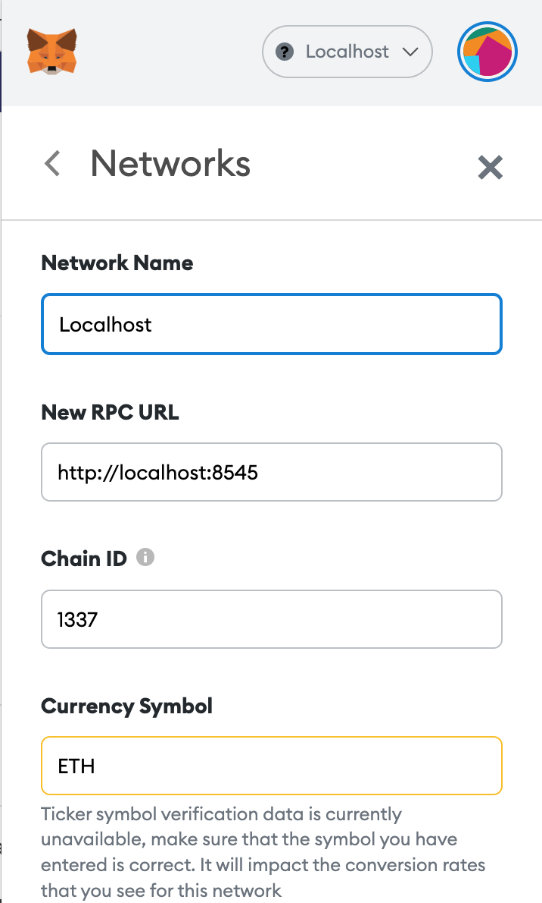

# Blockchain Project Group 12 Spring22 - Marketplace

This is a group project for building a marketplace that supports listing, selling, buying and creating Items on Ethereum Network. For test and development purposes, we used local network. User will be able to interact with a user interface and perform the actions mentioned before. We used Ether.js to communicate with the smart contract and web3modal to connect a wallet if a signer is needed. We used [1,2] ERC721 in our smart contract

1. Install all dependencies:

```shell
npm install
```

2. Run the node

```shell
npx hardhat node
```

If the node did not start running on the local host add --hostname argument in the command.

```shell
npx hardhat node --hostname 127.0.0.1
```

Open a new tab for the next commands and leave this one running.

3. Deploy the smart contract to the local node.

```shell
npx hardhat run scripts/deploy.js --network localhost
```


4. Install meta mask extension chrome (https://metamask.io/download/).

Alt + Shift + M -> Settings -> Networks -> Add Network

Configure the metamask network to connect with your local node. Since we defined the chain Id as 1337 inside hardhat.conig.js use the same value on metamask.



5. Run the client

```shell
npm run dev
```

[1] https://ethereum.org/en/developers/tutorials/how-to-write-and-deploy-an-nft/#write-contract
[2] https://docs.openzeppelin.com/contracts/3.x/erc721